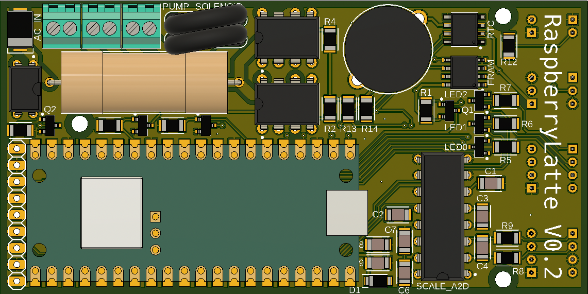

Introduction
==================
Welcome to the RaspberryLatte project, a full stack solution for taking your espresso routine to the next level (without breaking the bank).
This project was developed with the goal of elevating simple, single boiler espresso machines to fully featured, automatic machine capable of extensive customization and data collection.

Below, you will find a high level overview of the project.
The next section provides a full feature list of RaspberryLatte project so you can start getting excited about your new and improved machine!

.. danger::
    This project requires the modification of an appliance capable of high temperatures, high pressures, and large currents at line voltages.
    Do not attempt this project if you do not have the required training and tools.
    Doing so could result in loss of property, personal injury, or death. 

Project Overview
----------------
This project can be thought of in several layers. 

Hardware Level
^^^^^^^^^^^^^^^^^^^^
The lowest level is the hardware such as sensors and switches required to create a smart espresso machine. 
Additionally, a custom carrier board is needed to interface with these components. 

This PCB contains any circuitry required to support the sensors and switches. Mounted to this carrier board is the Raspberry Pi Pico W.
This microcontroller runs the RaspberryLatte firmware discussed below.

Firmware Level
^^^^^^^^^^^^^^^^^^^^
The next level consists of the firmware running on the Pico. 
This code, written in C, contains all the sensor drivers and machine logic. 
The firmware is partitioned onto a single core of the dual core Pico.

Network Level
^^^^^^^^^^^^^^^^^^^^
The network level runs on the second core on the Pico. 
It collects information from the firmware running on core 0 and shares that over BLE with the Mobile UI level (see below). 
It also passes settings received from a BLE client to the firmware so that the machines performance can be tailored to achieve the desired brew characteristics.

Mobile UI Level
^^^^^^^^^^^^^^^^^^^^
While ssh is fun, a mobile application would be significantly more convenient. 
This level would allow users to create and share their brew profiles for different coffees, visualize a shot's flow rate, pressure, temperature, etc. in real time, and troubleshoot their shots. 
This application would interface with the Network level using BLE, simplifying the connection process.